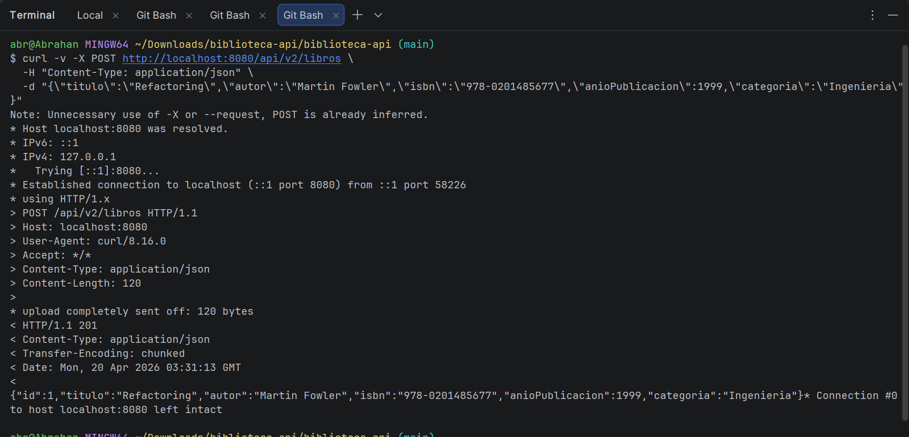
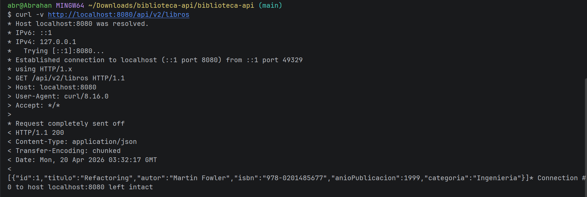
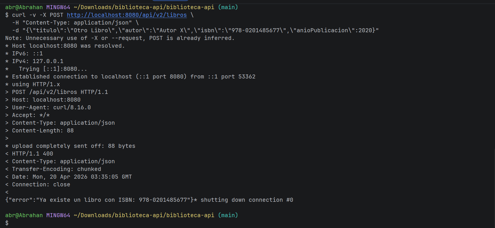
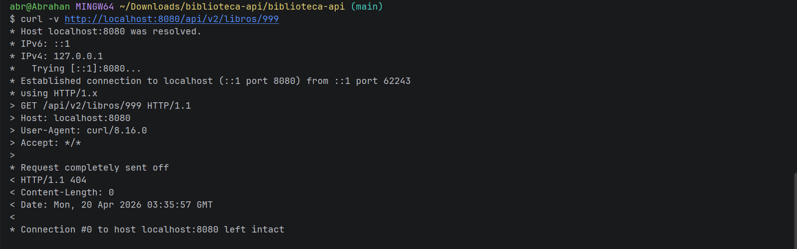
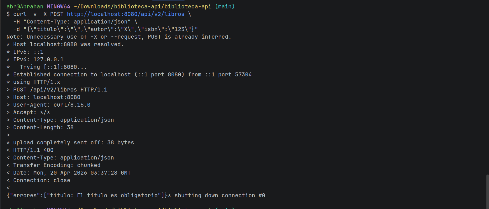

# API REST con DTOs, Manejo de Errores y Swagger

## Descripción del Proyecto

API REST construida con **Spring Boot 3.2.x** que implementa un catálogo de libros aplicando:

- **DTOs** (Data Transfer Objects) para separar el modelo de dominio del contrato público de la API.
- **Mapper** para conversión entre entidades JPA y DTOs.
- **Manejo global de errores** con `@RestControllerAdvice`.
- **Documentación interactiva** con SpringDoc / Swagger UI.
- **Validación de entrada** con Bean Validation (`@Valid`, `@NotBlank`, `@Min`, `@Max`).

---

## Arquitectura del Proyecto

```
src/main/java/com/universidad/patrones/
├── BibliotecaApiApplication.java       # Clase principal Spring Boot
├── controller/
│   └── LibroControllerV2.java          # Endpoints REST /api/v2/libros
├── dto/
│   ├── LibroRequestDTO.java            # DTO de entrada (datos del cliente)
│   └── LibroResponseDTO.java           # DTO de salida (respuesta de la API)
├── mapper/
│   └── LibroMapper.java                # Conversión Entity ↔ DTO
├── exception/
│   └── GlobalExceptionHandler.java     # Manejo global de errores (@RestControllerAdvice)
├── service/
│   └── LibroService.java               # Lógica de negocio
├── model/
│   └── Libro.java                      # Entidad JPA
└── repository/
    └── LibroRepository.java            # Repositorio Spring Data JPA
```

---

## Dependencias Principales

Agrega las siguientes dependencias en el `pom.xml`:

```xml
<!-- Spring Boot Web -->
<dependency>
    <groupId>org.springframework.boot</groupId>
    <artifactId>spring-boot-starter-web</artifactId>
</dependency>

<!-- Spring Data JPA -->
<dependency>
    <groupId>org.springframework.boot</groupId>
    <artifactId>spring-boot-starter-data-jpa</artifactId>
</dependency>

<!-- Validación -->
<dependency>
    <groupId>org.springframework.boot</groupId>
    <artifactId>spring-boot-starter-validation</artifactId>
</dependency>

<!-- H2 Database (en memoria) -->
<dependency>
    <groupId>com.h2database</groupId>
    <artifactId>h2</artifactId>
    <scope>runtime</scope>
</dependency>

<!-- Lombok -->
<dependency>
    <groupId>org.projectlombok</groupId>
    <artifactId>lombok</artifactId>
    <optional>true</optional>
</dependency>

<!-- SpringDoc OpenAPI / Swagger UI -->
<dependency>
    <groupId>org.springdoc</groupId>
    <artifactId>springdoc-openapi-starter-webmvc-ui</artifactId>
    <version>2.3.0</version>
</dependency>
```

---

## Configuración — application.properties

```properties
# Puerto del servidor
server.port=8080

# H2 Console
spring.h2.console.enabled=true
spring.datasource.url=jdbc:h2:mem:bibliotecadb

# Swagger UI
springdoc.swagger-ui.path=/swagger-ui.html
springdoc.api-docs.path=/api-docs
```

---

## Cómo Ejecutar el Proyecto

### Requisitos previos
- Java 17 o superior
- Maven 3.8+

### Pasos

1. Clonar el repositorio:
```bash
git clone https://github.com/Abrahan07/Remolina-post2-u5.git
cd Remolina-post2-u5
```

2. Compilar y ejecutar:
```bash
mvn spring-boot:run
```

3. Verificar que el servidor está corriendo:
```
Started BibliotecaApiApplication in X.XXX seconds
```

4. Acceder a la documentación Swagger UI:
```
http://localhost:8080/swagger-ui.html
```

---

## Endpoints Disponibles

| Método | Endpoint | Descripción | Respuesta |
|--------|----------|-------------|-----------|
| GET | `/api/v2/libros` | Listar todos los libros | 200 OK |
| GET | `/api/v2/libros/{id}` | Obtener libro por ID | 200 OK / 404 Not Found |
| POST | `/api/v2/libros` | Crear nuevo libro | 201 Created / 400 Bad Request |
| DELETE | `/api/v2/libros/{id}` | Eliminar libro por ID | 204 No Content |

---

## Evidencia de Endpoints — Verificación con curl

### 1. POST — Crear libro válido → `201 Created`

**Comando:**
```bash
curl -v -X POST http://localhost:8080/api/v2/libros \
  -H "Content-Type: application/json" \
  -d "{\"titulo\":\"Refactoring\",\"autor\":\"Martin Fowler\",\"isbn\":\"978-0201485677\",\"anioPublicacion\":1999,\"categoria\":\"Ingenieria\"}"
```

**Respuesta:**
```
< HTTP/1.1 201
< Content-Type: application/json
{"id":1,"titulo":"Refactoring","autor":"Martin Fowler","isbn":"978-0201485677","anioPublicacion":1999,"categoria":"Ingenieria"}
```



---

### 2. GET — Listar todos los libros → `200 OK`

**Comando:**
```bash
curl -v http://localhost:8080/api/v2/libros
```

**Respuesta:**
```
< HTTP/1.1 200
< Content-Type: application/json
[{"id":1,"titulo":"Refactoring","autor":"Martin Fowler","isbn":"978-0201485677","anioPublicacion":1999,"categoria":"Ingenieria"}]
```



---

### 3. POST — ISBN duplicado → `400 Bad Request`

**Comando:**
```bash
curl -v -X POST http://localhost:8080/api/v2/libros \
  -H "Content-Type: application/json" \
  -d "{\"titulo\":\"Otro Libro\",\"autor\":\"Autor X\",\"isbn\":\"978-0201485677\",\"anioPublicacion\":2020}"
```

**Respuesta:**
```
< HTTP/1.1 400
< Content-Type: application/json
{"error":"Ya existe un libro con ISBN: 978-0201485677"}
```



---

### 4. GET — ID inexistente → `404 Not Found`

**Comando:**
```bash
curl -v http://localhost:8080/api/v2/libros/999
```

**Respuesta:**
```
< HTTP/1.1 404
```



---

### 5. POST — Título vacío → `400 Bad Request` con errores de validación

**Comando:**
```bash
curl -v -X POST http://localhost:8080/api/v2/libros \
  -H "Content-Type: application/json" \
  -d "{\"titulo\":\"\",\"autor\":\"X\",\"isbn\":\"123\"}"
```

**Respuesta:**
```
< HTTP/1.1 400
< Content-Type: application/json
{"errores":["titulo: El título es obligatorio"]}
```



---

## Patrones de Diseño Aplicados

- **DTO (Data Transfer Object):** `LibroRequestDTO` y `LibroResponseDTO` desacoplan el modelo de dominio del contrato público de la API.
- **Mapper:** `LibroMapper` centraliza la lógica de conversión entre capas.
- **Repository Pattern:** `LibroRepository` abstrae el acceso a datos mediante Spring Data JPA.
- **Layered Architecture (MVC + Service + Repository):** Separación clara de responsabilidades en capas.
- **Global Exception Handler:** `GlobalExceptionHandler` con `@RestControllerAdvice` intercepta todas las excepciones y retorna respuestas HTTP semánticamente correctas.

---
